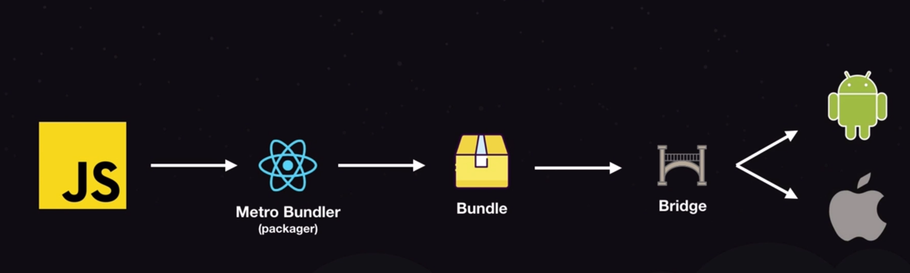
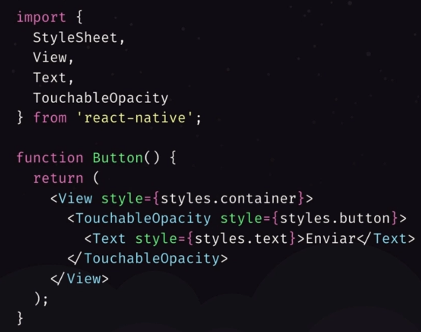
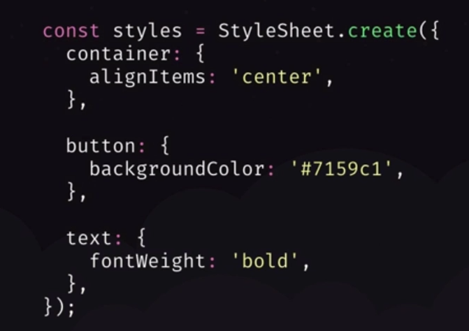

<h1 align="center">Fundamentos do React Native</h1>

É a versão do React para desenvolvimento móvel. O React Native é multiplataforma, consiste no desenvolvimento de um
único código-fonte que será executado em diferentes dispositivos, como iOS e Android, também é possível fazer
manipulação de elementos dentro em cada plataforma. Ele converte o código JavaScript desenvolvido para a interface
nativa da plataforma, mas não faz toda a transpilação do código, ele injeta uma dependência chamada JavaScriptCore em
dispositivos móveis que permite que eles entendam JavaScript.

## Arquitetura

[React-Native — Arquitetura e comparações](https://medium.com/datainfo/react-native-arquitetura-e-compara%C3%A7%C3%B5es-1663f77e0a57)

## Sintaxe

A forma de criar componentes é semelhante ao desenvolvimento web ReactJS. Porem HTML não é usado, mas sim componentes do
próprio React Native.

Nem um elemento no React Native não tem estilização própria.

## Configuração do Ambiente React Native

[Ambiente React Native](https://react-native.rocketseat.dev/)
